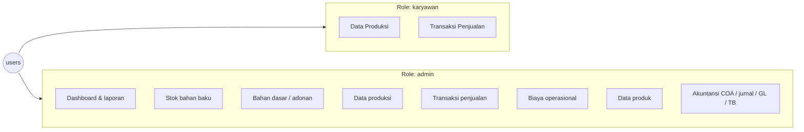
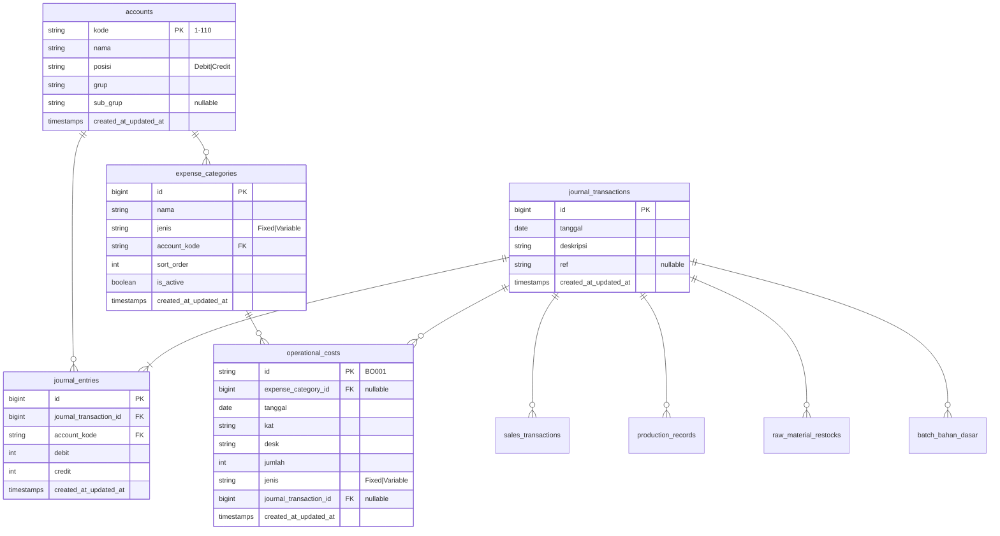

# ERD — Tandi's Bakery

Dokumen ini mencerminkan **implementasi aktual** (migrasi Laravel + model Eloquent), bukan rancangan konseptual lama.

**Terakhir diselaraskan dengan kode:** Juni 2026

| Format | File |
|--------|------|
| **draw.io — konseptual** (oval, PK garis bawah, kardinalitas) | [`ERD-konseptual.drawio`](ERD-konseptual.drawio) |
| **draw.io — teknis** (nama tabel & kolom) | [`ERD.drawio`](ERD.drawio) |
| Markdown + Mermaid (di repo) | `ERD.md` (file ini) |

Regenerasi draw.io setelah perubahan migrasi:

```bash
# Jika Python di PATH:
python docs/generate_erd_drawio.py

# Atau via Laragon (Windows):
D:\Laragon\laragon\bin\python\python-3.13\python.exe docs/generate_erd_drawio.py
D:\Laragon\laragon\bin\python\python-3.13\python.exe docs/generate_erd_konseptual_drawio.py
```

---

## Catatan desain

| Topik | Implementasi |
|--------|----------------|
| Peran pengguna | Satu tabel `users` dengan kolom `role` (`admin` \| `karyawan`), bukan entitas Admin/Karyawan terpisah |
| Pembatasan akses | Di layer aplikasi (middleware `role`, route), bukan foreign key di tabel transaksi |
| Laporan keuangan | **Tidak** disimpan sebagai tabel; dihitung dari jurnal, penjualan, HPP, biaya operasional (`ReportController`, `AccountingService`, export PDF) |
| Penjualan | Satu tabel `sales_transactions` (rekap harian), bukan pemisahan rekap + detail baris |
| Hasil produksi | Data hasil ada di `production_records`; master produk di `products` dengan FK `production_record_id` |
| Audit aktivitas | `activity_logs` mencatat `user_id` (opsional), nama, dan role saat aksi |

---

## Pembagian akses (aplikasi)



---

## Diagram ERD — inti bisnis

```mermaid
erDiagram
    users ||--o{ activity_logs : "mencatat"
    users ||--o{ sessions : "login"

    production_records ||--o| products : "menghasilkan"
    production_records ||--o{ production_material_usages : "memakai_bahan_baku"
    raw_materials ||--o{ production_material_usages : ""
    raw_materials ||--o{ raw_material_restocks : "restock"
    raw_material_restocks ||--o{ production_material_usages : "batch_FEFO"

    production_records ||--o{ pemakaian_bahan_dasar_produksi : "memakai_adonan"
    bahan_dasar ||--o{ batch_bahan_dasar : "batch"
    batch_bahan_dasar ||--o{ pemakaian_bahan_dasar_produksi : ""
    bahan_dasar ||--o{ pemakaian_bahan_dasar_produksi : ""
    batch_bahan_dasar ||--o{ pemakaian_bahan_baku_adonan : "komposisi"
    raw_materials ||--o{ pemakaian_bahan_baku_adonan : ""
    raw_material_restocks ||--o{ pemakaian_bahan_baku_adonan : "batch_opsional"

    sales_transactions }o--o| journal_transactions : "jurnal_penjualan"
    production_records }o--o| journal_transactions : "jurnal_produksi"
    operational_costs }o--o| journal_transactions : "jurnal_operasional"
    raw_material_restocks }o--o| journal_transactions : "jurnal_restock"
    batch_bahan_dasar }o--o| journal_transactions : "jurnal_batch_adonan"

    journal_transactions ||--|{ journal_entries : "baris"
    accounts ||--o{ journal_entries : "akun"
    expense_categories }o--|| accounts : "akun_biaya"
    operational_costs }o--o| expense_categories : "kategori"

    users {
        bigint id PK
        string name
        string username UK
        string email UK "nullable"
        string password
        string role "admin|karyawan"
        timestamps created_at_updated_at
    }

    activity_logs {
        bigint id PK
        bigint user_id FK "nullable"
        string user_name
        string user_role
        string action
        string object
        string menu
        timestamps created_at_updated_at
    }

    production_records {
        string id PK "PRD001"
        date tanggal
        string product_name
        int jumlah
        string satuan
        string status "Berhasil|Gagal"
        string notes "nullable"
        bigint total_material_cost
        bigint journal_transaction_id FK "nullable"
        timestamps created_at_updated_at
    }

    products {
        string id PK "P001"
        string production_record_id FK UK "nullable"
        string nama
        string satuan
        int jumlah "stok_produk"
        int harga
        timestamps created_at_updated_at
    }

    production_material_usages {
        bigint id PK
        string production_record_id FK
        string raw_material_id FK
        bigint raw_material_restock_id FK "nullable"
        decimal jumlah
        string satuan
        int harga_satuan
        bigint total
        timestamps created_at_updated_at
    }

    raw_materials {
        string id PK "SBB001"
        string nama
        decimal jumlah "stok_agregat"
        string satuan
        decimal min
        string kategori "nullable"
        int harga
        timestamps created_at_updated_at
    }

    raw_material_restocks {
        bigint id PK
        string raw_material_id FK
        date tanggal
        string kode_produksi "nullable"
        date expired "nullable"
        decimal jumlah
        decimal sisa "batch_sisa"
        int harga
        bigint total
        string catatan "nullable"
        bigint journal_transaction_id FK "nullable"
        timestamps created_at_updated_at
    }

    bahan_dasar {
        string id PK
        string nama
        decimal jumlah
        string satuan
        decimal min
        bigint harga
        timestamps created_at_updated_at
    }

    batch_bahan_dasar {
        bigint id PK
        string bahan_dasar_id FK
        date tanggal
        decimal jumlah
        decimal sisa
        bigint total_biaya
        string catatan "nullable"
        bigint journal_transaction_id FK "nullable"
        timestamps created_at_updated_at
    }

    pemakaian_bahan_baku_adonan {
        bigint id PK
        bigint batch_bahan_dasar_id FK
        string raw_material_id FK
        bigint raw_material_restock_id FK "nullable"
        decimal jumlah
        string satuan
        bigint harga_satuan
        bigint total
        timestamps created_at_updated_at
    }

    pemakaian_bahan_dasar_produksi {
        bigint id PK
        string production_record_id FK
        bigint batch_bahan_dasar_id FK
        string bahan_dasar_id FK
        decimal jumlah
        string satuan
        bigint harga_satuan
        bigint total
        timestamps created_at_updated_at
    }

    sales_transactions {
        string id PK "TRS001"
        date tanggal
        int total "rupiah"
        string metode "Cash|Transfer|Mix"
        int jumlah "jumlah_transaksi"
        bigint journal_transaction_id FK "nullable"
        timestamps created_at_updated_at
    }

    units {
        bigint id PK
        string nama UK
        timestamps created_at_updated_at
    }
```

---

## Diagram ERD — akuntansi & operasional



---

## Laporan (virtual — tidak ada tabel)

Laporan dihasilkan saat runtime dari data berikut:

| Laporan (UI) | Sumber data |
|----------------|-------------|
| Laba rugi | `journal_entries` + `accounts` via `AccountingService` |
| Laporan penjualan | `sales_transactions` |
| Neraca | `accounts` + saldo jurnal |
| General ledger | `journal_entries` |
| Trial balance | agregasi `journal_entries` |
| PDF | `PdfReportController` (export, tidak menyimpan `file_path` di DB) |

---

## Pemetaan istilah ERD lama → implementasi

| Konsep ERD lama | Tabel / mekanisme sekarang |
|-----------------|----------------------------|
| Karyawan / Admin | `users.role` |
| Produksi | `production_records` |
| Hasil_Produksi | Kolom di `production_records` + relasi `products` |
| Produk (`Kode_Produk`) | `products.id` |
| Bahan (`Kode_Bahan`) | `raw_materials` (+ `bahan_dasar` untuk adonan) |
| Detail_Pakai | `production_material_usages` |
| Trsk_Penjualan + Transaksi | `sales_transactions` (gabungan) |
| Operasional + Rincian | `operational_costs` (satu baris = satu rincian) + `expense_categories` |
| Laporan (entitas) | Tidak ada; laporan virtual |
| — (tambahan) | `journal_*`, `activity_logs`, `units`, batch stok |

---

## Relasi penting (ringkas)

1. **Produksi → produk:** `products.production_record_id` → `production_records.id` (opsional, unique).
2. **Produksi → bahan baku:** `production_material_usages` (many-to-many dengan atribut jumlah & biaya).
3. **Produksi → bahan dasar (adonan):** `pemakaian_bahan_dasar_produksi` → `batch_bahan_dasar`.
4. **Adonan → bahan baku:** `pemakaian_bahan_baku_adonan` pada saat `buat adonan`.
5. **Stok batch bahan baku:** `raw_material_restocks.sisa` + FK di `production_material_usages.raw_material_restock_id`.
6. **Jurnal otomatis:** penjualan, produksi, operasional, restock, dan batch adonan dapat terhubung ke `journal_transactions`.
7. **Audit:** `activity_logs.user_id` → `users` (tidak menggantikan FK karyawan di tabel transaksi).

---

## Tabel infrastruktur Laravel (di luar ERD bisnis)

Tidak digambarkan di diagram utama: `sessions`, `password_reset_tokens`, `cache`, `cache_locks`, `jobs`, `job_batches`, `failed_jobs`.

---

## Cara memperbarui dokumen ini

Setelah mengubah migrasi atau model, perbarui bagian diagram dan tabel atribut di file ini agar tetap selaras dengan `database/migrations/` dan `app/Models/`.
